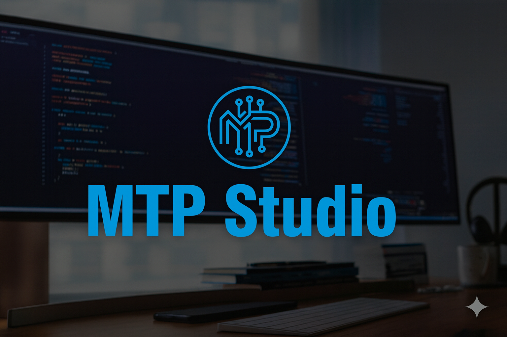

# MTP Studio Manager

> [!NOTE]
> This resource belong to a studio i has contributed.

> [!IMPORTANT]
> This project was created for my major assignment. not for commercial purposes.

   

---

# Overview

MTP Studio Manager is a comprehensive application designed to streamline the management of studio operations. It offers a user-friendly interface for handling various tasks such as scheduling, client management, and resource allocation. With a focus on efficiency and organization, MTP Studio Manager aims to enhance productivity and improve overall studio workflow.

# Features
- User Authentication: Secure login and registration system.
- Dashboard: Centralized view of all studio activities and metrics.
- Client Management: Tools for managing client information and interactions.
- Resource Allocation: Efficient management of studio resources and equipment.
- Responsive Design: Optimized for both desktop and mobile devices.

# Installation
1. Clone the repository: `git clone https://github.com/truong9c2208/studio-manager.git`
2. Navigate to the project directory: `cd studio-manager`
3. Install dependencies: `npm install`
4. Start the application: `npm start`
5. Open your browser and go to `http://localhost:3000`

# Usage
1. Register for a new account or log in with existing credentials.
2. Navigate through the dashboard to access different features.
3. Use the client management tools to add, edit, or remove clients.
4. Allocate resources as needed for studio operations.

# Contributing
Contributions are welcome! Please fork the repository and submit a pull request with your changes.

# License
This project is licensed under the MIT License. See the [LICENSE](LICENSE) file for details.